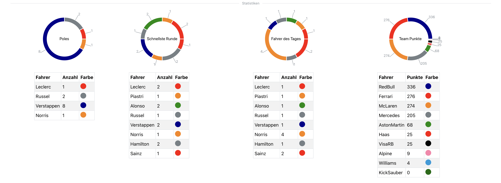

## Table of Contents

1. [Überblick](#overview)
2. [Problem](#problem)
3. [Ziel](#goal)
4. [Lösung](#solution)
   - [Schritte zur Nutzung](#schritte-zur-nutzung)
   - [Ligaverwaltung](#ligaverwaltung)
   - [Discord Bot Integration](#discord-bot-integration)
5. [Herausforderungen und Lernerfahrungen](#herausforderungen-und-lernerfahrungen)
6. [Abschließende Überlegungen](#abschliessende-ueberlegungen)

---

## Überblick

**F1 Liga Bot** ist eine React‑basierte Webanwendung zur Organisation von Online‑Rennligen. Nutzer können Ligen anlegen, Fahrer verwalten, Ergebnisse eintragen und diese Informationen bequem mit einem Discord Bot teilen.

---

## ❓ Problem

1. Rennligen organisieren ihre Daten meist manuell in Tabellen oder verteilten Tools.
2. Ergebnisse und Ankündigungen sollen automatisch im Discord Server erscheinen.

---

## 🎯 Ziel

1. Einheitliche Verwaltung von Fahrern, Teams und Rennkalender.
2. Automatische Veröffentlichung von Ergebnissen über einen Discord Bot.

---

## ✨ Lösung

### Schritte zur Nutzung

- Registrierung und Anmeldung via Firebase Authentication
- Anlegen einer neuen Liga und Einladen des Discord Bots
- Fahrer und Teams hinzufügen, Rennen planen und Resultate erfassen

### Ligaverwaltung

Die Einstellungsseite erlaubt das Bearbeiten aller Ligadaten. Strecken können per Datum sortiert werden, ein Editor auf Basis von **Tiptap** ermöglicht das Gestalten der Ligaseite, und Statistiken werden mit **Recharts** visualisiert.

### Discord Bot Integration

Ein zugehöriger Bot postet Rennresultate direkt in Discord‑Kanäle. Die Verbindung wird über die Weboberfläche eingerichtet.

---

## ⚙️ Herausforderungen und Lernerfahrungen

1. **Firebase Datenstruktur**: Optimale Speicherung von Fahrerdaten und Kalender.
2. **Mehrsprachigkeit**: Umsetzung mit **i18next** für Deutsch und Englisch.
3. **Responsive Design**: Mantine und MUI sorgen für konsistente Darstellung auf allen Geräten.

---

## ✨ Abschließende Überlegungen

Das F1 Liga Bot Webportal vereinfacht die Organisation von Rennligen und verbindet sie direkt mit Discord. Dank Firebase Hosting ist keine eigene Serverinfrastruktur nötig.

---
