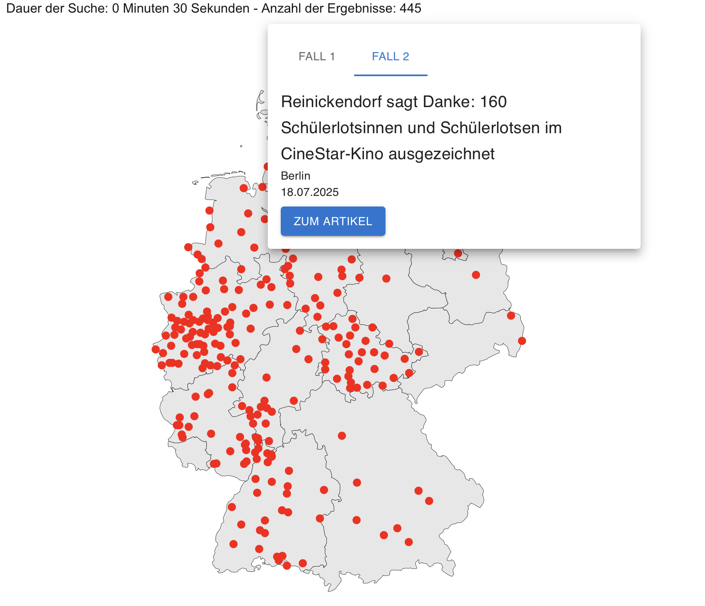

## Table of Contents

1. [Überblick](#overview)
2. [Problem](#problem)
3. [Ziel](#goal)
4. [Lösung](#solution)
   - [Datenquellen](#datenquellen)
   - [Wie funktioniert die Suche?](#wie-funktioniert-die-suche)
   - [Interaktive Kartenansicht](#interaktive-kartenansicht)
   - [Benutzerführung](#benutzerfuehrung)
5. [Herausforderungen und Lernerfahrungen](#challenges-and-learnings)
6. [Abschließende Überlegungen](#final-thoughts)

---

## Überblick

**PresseFinder** ist eine Webanwendung, mit der Nutzer schnell Pressemitteilungen aus verschiedenen Quellen finden können. Neben einer klassischen Tabellenansicht steht eine Kartenansicht zur Verfügung, die alle Fundorte visualisiert.

---

## ❓ Problem

1. Pressemitteilungen sind oftmals über viele Portale verteilt.
2. Vergleichbare Plattformen bieten selten eine Kartenübersicht.

---

## 🎯 Ziel

1. Zentrale Suche für Pressemitteilungen mit Filter nach Zeitraum.
2. Kartenbasierte Darstellung der Fundorte.

---

## ✨ Lösung

### Datenquellen

Die Anwendung sammelt Informationen von

- **presseportal.de** und **berlin.de**

### Wie funktioniert die Suche?

- Eingabe eines Suchbegriffs sowie Start- und Enddatum
- Abruf der Daten über einen Next.js API-Endpoint
- Ergebnisse werden in einer Tabelle und alternativ auf einer Deutschlandkarte angezeigt

### Interaktive Kartenansicht

- Marker auf der Karte zeigen den Standort der Meldung
- Popover mit Details und Link zum Originalartikel

---

## ⚙️ Herausforderungen und Lernerfahrungen

1. **Datenkonsistenz**: Unterschiedliche Formate der Quellen erforderten eine Vereinheitlichung.
2. **Performance**: Das gleichzeitige Abrufen mehrerer Quellen.
3. **Responsive Design**: Karten- und Tabellenansicht mussten sowohl auf Desktop als auch mobil gut funktionieren.

---

## ✨ Abschließende Überlegungen

PresseFinder vereint Pressemitteilungen mehrerer Plattformen in einer Anwendung. Durch die Kartenvisualisierung erhalten Nutzer einen schnellen geografischen Überblick über die Fundorte der Meldungen.

---
