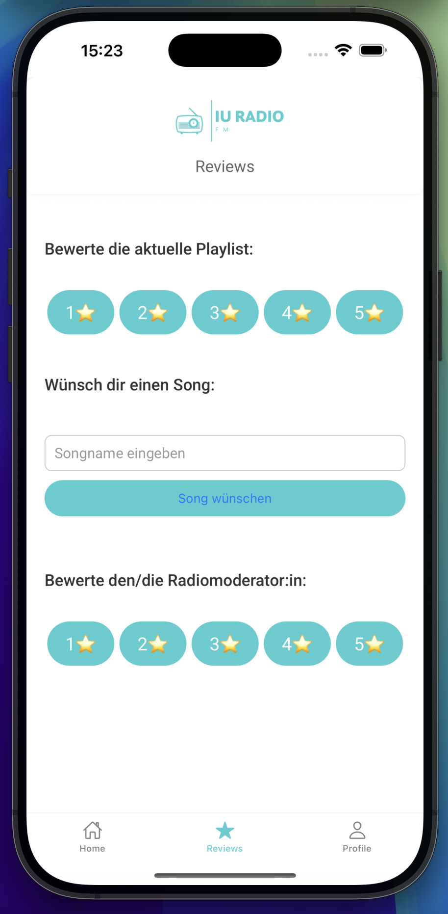

## Table of Contents

1. [Überblick](#overview)
2. [Problem](#problem)
3. [Ziel](#goal)
4. [Lösung](#solution)
   - [Authentifizierung](#authentifizierung)
   - [Bewertung und Wünsche](#bewertung-und-wuensche)
   - [Realtimedaten](#realtimedaten)
   - [Rollenbasierte Navigation](#rollenbasierte-navigation)
5. [Herausforderungen und Lernerfahrungen](#challenges-and-learnings)
6. [Abschließende Überlegungen](#final-thoughts)

---

## Überblick

**Radio App** ist eine mit Expo entwickelte React‑Native‑Anwendung. Sie zeigt den aktuell laufenden Song inklusive Fortschrittsbalken und Visualisierung an. Nutzer können Songs bewerten oder Wünsche an die Moderation schicken. Moderatoren erhalten zusätzliche Ansichten, um eingehende Bewertungen und Songwünsche in Echtzeit zu sehen.

---

## ❓ Problem

1. Radiostreams bieten meist keine direkte Möglichkeit, Feedback zur laufenden Playlist abzugeben.
2. Wünsche oder Bewertungen müssen oft per E-Mail oder Telefon erfolgen und sind nicht zentral erfasst.

---

## 🎯 Ziel

1. Einfache Anmeldung und Rollenverteilung (Hörer oder Moderator) über Supabase.
2. Bewertungsfunktion für Hörer sowie direkte Songwünsche aus der App heraus.
3. Echtzeitansicht für Moderatoren, um Feedback und Wünsche sofort einsehen zu können.

---

## ✨ Lösung

### Authentifizierung

Die App nutzt Supabase zur Benutzerverwaltung. Beim Registrieren kann ein Benutzer angeben, ob er Moderator sein möchte.
Je nach Rolle zeigt der Tab‑Navigator unterschiedliche Screens an​.

### Bewertung und Wünsche

Auf dem Reviews‑Screen können Hörer die aktuelle Playlist bewerten und Songs anfragen. Bewertungen und Songwünsche werden in die Tabellen `ratings` bzw. `requests` geschrieben​.

### Realtimedaten

Moderatoren sehen auf dem Sender‑Screen eine Liste aller Bewertungen und Songwünsche. Über Supabase-Channels werden neue Einträge live aktualisiert, ohne die App neu zu laden​.

### Rollenbasierte Navigation

Nicht-Moderatoren erhalten Tabs für Home, Reviews und Profil. Moderatoren sehen stattdessen einen Tab, der die Sender-Verwaltung mit den Echtzeitdaten öffnet​.

---

## ⚙️ Herausforderungen und Lernerfahrungen

1. **Supabase-Realtime**: Die Umsetzung der Live-Updates über Channels erforderte eine sorgfältige Behandlung der empfangenen Payloads.
2. **State-Management**: Aktuell laufende Songs werden über einen globalen Kontext bereitgestellt, was die Synchronisierung von Fortschrittsanzeige und Songwechsel vereinfachte​.
3. **UI mit NativeWind**: Die Kombination aus Tailwind-Klassen und React Native (über NativeWind) ermöglichte ein konsistentes Styling auf verschiedenen Plattformen.

---

## ✨ Abschließende Überlegungen

Die Radio App zeigt, wie sich Streaming, Nutzerfeedback und moderierte Inhalte in einer mobilen Anwendung vereinen lassen. Supabase liefert dabei Authentifizierung sowie Datenhaltung inklusive Realtime-Funktionalität. Das Projekt kann als Grundlage für weitere Funktionen – etwa Push-Notifications oder ein erweitertes Moderationspanel dienen.

---
